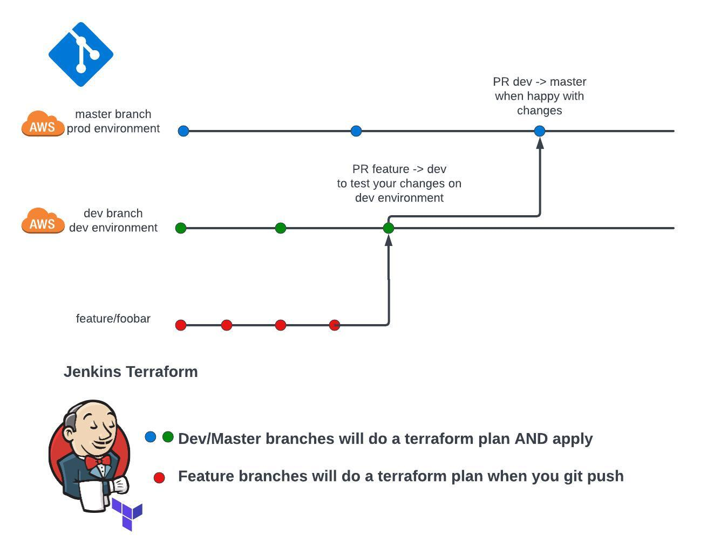
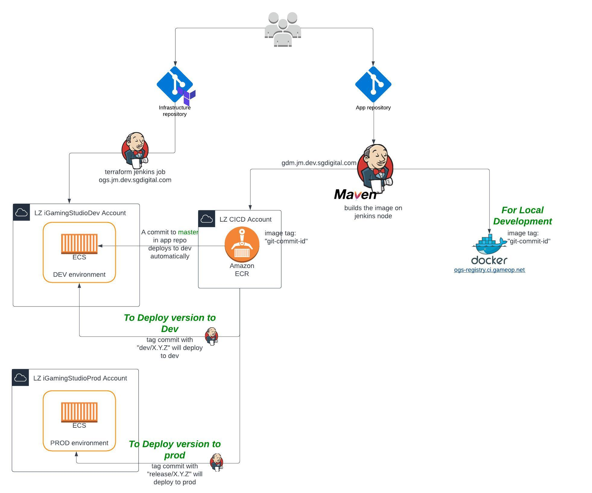

### kdot - Portfolio Project

example project including:
- Replay ECS service Terraform
- Kafka Terraform
- cloudwatch alarms Terraform
- Lambda go packages
- Jenkinsfiles groovy scripts for CI/CD
- Terraform variables
- Terraform modules
- Replay DB postgres user creation Terraform
- shell/bash script for go script package creation
- Documentation

## Create a PR with DEV initially then PR to master

Runs the terraform plan/apply
## Project branching structure

## Create a PR with DEV initially then PR to master

### Relevant files/folders

## replay_app_repo/
contains example of a replay-service app repo jenkinsfile only

## connector_status_lambda_pkg/
contains example of a jdbc-connector-status lambda package written in go

## replay_duration_lambda_pkg/
contains example of a replay-duration lambda package written in go

## pipelines/
contains example of a groovy resuable pipeline to update an ecs service

## *.tfvars
a dev and prod terraform variable file

## Jenkinsfile
A groovy script to update and run the terraform plan/apply

## Jenkinsfile_destroy
A groovy script to update and run the terraform destroy

## Jenkinsfile_update_service_dev
A groovy script to update a service in the dev environment for developers

## replay_db.tf
rds database creation via terraform and user creation via postgres provider

## Overall project structure

## AWS Alarms with TF Guide
Read [this guide](aws_alarms.md)